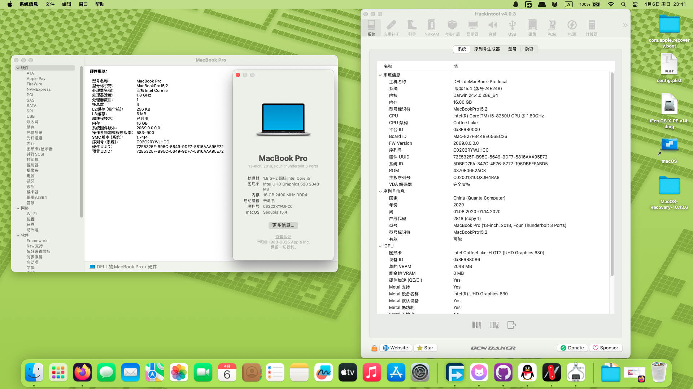

# Dell-Vostro-5370-i5-8250U-Hackintosh
应用于Dell Vostro 5370的OpenCore 1.0.4的黑苹果引导 支持macOS Sequoia 15.4

注意：
- 此EFI不含三码 实际使用时请自行使用[OCAT](https://github.com/ic005k/OCAuxiliaryTools)生成
- 从macOS Sequoia开始，Intel Wi-Fi网卡需要使用[OCLP-Mod](https://github.com/laobamac/OCLP-Mod/releases)打补丁才可使用。


### 配置清单
|类型|型号|规格|
|---|---|---|
|CPU|Intel Core i5-8250U|1.60 GHz|
|内存|Micron MT16ATF2G64AZ-3G2J1 16GB|3200 MHz|
|SSD|杂牌 NVMe|512 GB|
|iGPU|Intel UHD Graphics 620|2048 MB|
|Wi-Fi|Intel Wi-Fi AC-3165|m.2|
|声卡|RealTek ALC295|立体声|
|操作系统|macOS Big Sur-Sequoia|11.0-15.4|
|BIOS|Dell UEFI(12 Apr 2022)|1.22.0|

#### 无法工作的部分
- 隔空投送和接力：需要更换博通WI-FI网卡，并使用OCLP-Mod打补丁。
- DRM硬结：无解
- iPhone 镜像：无解


#### 附注事项
- 需要关闭CFG Lock，你可以在[这里](https://www.dell.com/support/product-details/zh-cn/product/vostro-13-5370-laptop/drivers)下载并更新最新版的BIOS，并在Grub Shell里输入以下指令：
```
setup_var 0x527 0x00
```
- 暂未解决睡眠和休眠唤醒问题，如果出现睡死或唤醒闪屏问题，可使用终端强制关闭睡眠功能：
```
sudo pmset -a sleep 0
sudo pmset -a hibernatemode 0
sudo pmset -a disablesleep 1
```
- 此EFI理论可兼容**Mojave - Catalina**系列老版本的macOS，但目前未做进一步测试。